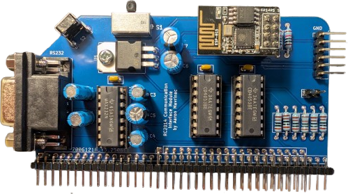

# RC2014 Communication Interface Module

This is a serial communication module for [RC2014](https://rc2014.co.uk/) computers providing an easy way to switch dual serial port connections between RS232, FTDI, and an ESP01 module.

| Switch Position | Port A | Port B |
|-----------------|--------|--------|
| left            | FTDI   | ESP01  |
| middle          | RS232  | ESP01  |
| right           | RS232  | FTDI   |

These configuration options allow you to switch between a PC and a serial terminal as the main console, connect either to an ESP01 modem using [Zimodem](https://github.com/bozimmerman/Zimodem) or similar, and do XMODEM transfers over FTDI from a serial terminal.

## Bill of Materials

| Reference | Part                             |
|-----------|----------------------------------|
|     U1    | LD1117V33                        |
|     U2    | MAX232N                          |
|   U3-U4   | CD4053B                          |
|   R1-R6   | 1K resistor                      |
|     R7    | 3.3K resistor                    |
|     R8    | 4.7K resistor                    |
|   R9-R10  | 10K resistor                     |
|   C1-C4   | 1uF electrolytic capacitor       |
|   C5-C6   | 10uF electrolytic capacitor      |
|     C7    | 47uF electrolytic capacitor      |
|   C8-C10  | 0.1uF disc/MLCC capacitor        |
|     S1    | EG2315 DP3T slide switch         |
|     S2    | right angle tactile switch       |
|     J1    | 1x6 0.1" right angle pin header  |
|     J2    | DE9 female socket                |
|     J3    | 2x8 0.1" straight pin socket     |
|    JP1    | 1x2 0.1" straight pin header     |
|    BUS    | 2x40 0.1" right angle pin header |

For the DE9 socket (J2), use [NorComp 182-009-213R561](https://www.digikey.ca/en/products/detail/norcomp-inc/182-009-213R561/1120101) or similar.

This module optionally connects RTS signals to the RS232 and FTDI connectors. If you are using the [Dual Serial Module SIO/2](https://rc2014.co.uk/modules/dual-serial-module-sio2/), to use the RTS signals, you will need to bodge pin 17 (RTSA) of U3 to pin 37 (SPARE1) of the bus, and pin 24 (RTSB) of U3 to pin 38 (SPARE2) of the bus. Otherwise, you can leave R5 and R6 unpopulated.
